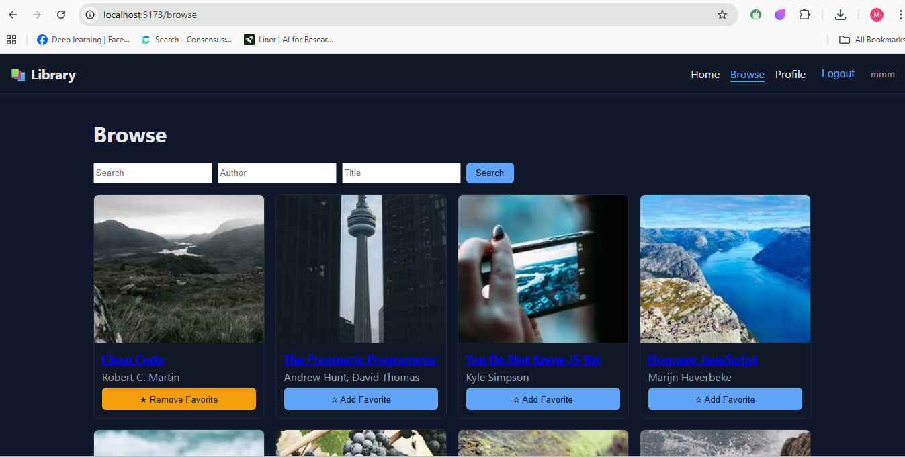

# Library Website — Node.js + React

[](https://github.com/mmahmoudai/library-trae)
#Build_with_trae



This repository scaffolds a full-stack library website built with a Node.js/Express backend and a React frontend. It includes authentication, book browsing with search/filters, favorites, and a responsive UI.

## Tech Stack
- Backend: `Node.js`, `Express`, `MongoDB` via `Mongoose`, `JWT`
- Frontend: `React`, `React Router`, `Vite`
- Testing: `Jest` (backend), `Vitest` + `React Testing Library` (frontend)
- Linting/Formatting: `ESLint`, `Prettier`
- CI/CD: GitHub Actions

## Directory Structure
```
.
├─ server
│  ├─ controllers
│  ├─ models
│  ├─ routes
│  ├─ middleware
│  ├─ config
│  ├─ tests
│  ├─ server.js
│  ├─ package.json
│  └─ README.md
├─ client
│  ├─ src
│  │  ├─ components
│  │  │  ├─ auth
│  │  │  ├─ books
│  │  │  ├─ user
│  │  │  └─ shared
│  │  ├─ pages
│  │  ├─ context
│  │  ├─ hooks
│  │  ├─ services
│  │  ├─ styles
│  │  └─ App.js
│  ├─ index.html
│  ├─ package.json
│  └─ vite.config.js
├─ docs
│  ├─ API.md
│  └─ COMPONENTS.md
├─ .github/workflows/ci.yml
└─ .gitignore
```

## Core Features
- Authentication: register, login, JWT, protected routes
- Profile management: update user details
- Book browsing: search by query/author/title, with pagination
- Book details: view single book
- Favorites: add/remove favorite books
- Responsive home page and navigation

## Setup
1. Prerequisites: Node.js 18+, MongoDB running locally or in the cloud.
2. Backend:
   - `cd server`
   - `npm install`
   - Create `.env` from `.env.example`
   - `npm run dev`
3. Frontend:
   - `cd client`
   - `npm install`
   - Create `.env` from `.env.example`
   - `npm run dev`

## Scripts
- Backend: `npm run dev` (nodemon), `npm test`, `npm run lint`, `npm run format`
- Frontend: `npm run dev`, `npm test`, `npm run lint`, `npm run format`, `npm run build`

## Implementation Plan
- Authentication: secure endpoints; store JWT client-side; protect routes with middleware and React context.
- Profile: `GET/PUT /api/users/profile` to retrieve/update profile.
- Books: `GET /api/books` with `q`, `author`, `title`, `page`, `limit` params; `GET /api/books/:id` for details.
- Favorites: `POST /api/books/:id/favorite`, `DELETE /api/books/:id/favorite` behind auth.
- UI/UX: responsive grid/flex layout, accessible forms, keyboard navigation, consistent theme, loading and error states.
- Testing: unit and integration tests for controllers (Jest); component tests for UI flows (Vitest + RTL).
- CI: lint, test, build on PRs; optional deployment step for production.

## API Overview
See `docs/API.md` for endpoints, params, and expected responses.

## UI/UX Guidelines
- Use semantic HTML and ARIA where necessary
- Ensure color contrast and focus states (WCAG 2.1 AA)
- Mobile-first responsive design with CSS Grid/Flexbox
- Keep navigation obvious with `Navbar` and clear page titles

## Database Schema
- Users: `{ id, name, email, password, createdAt }`
- Books: `{ id, title, author, description, coverImage, createdAt }`
- Favorites: `{ userId, bookId, createdAt }`, unique pair `(userId, bookId)`

## Security Considerations
- Password hashing with bcrypt
- Input validation/sanitization on all user-provided data
- Rate limiting and basic DDoS protection headers via Helmet
- CORS configured per environment
- HTTPS recommended in production (reverse proxy or cloud platform TLS)

## Development Process
- Initialize Git: `git init` and configure remote
- Configure ESLint + Prettier (already provided)
- Testing: run backend and frontend tests in CI
- CI/CD: GitHub Actions workflow `ci.yml` runs lint, tests, and build

## Environment Variables
- Backend: `PORT`, `MONGO_URI`, `JWT_SECRET`, `CORS_ORIGIN`
- Frontend: `VITE_API_URL`

## Next Steps
- Populate sample books data (seed script) as needed
- Integrate deployment (e.g., Render/Heroku for backend, Netlify/Vercel for frontend)